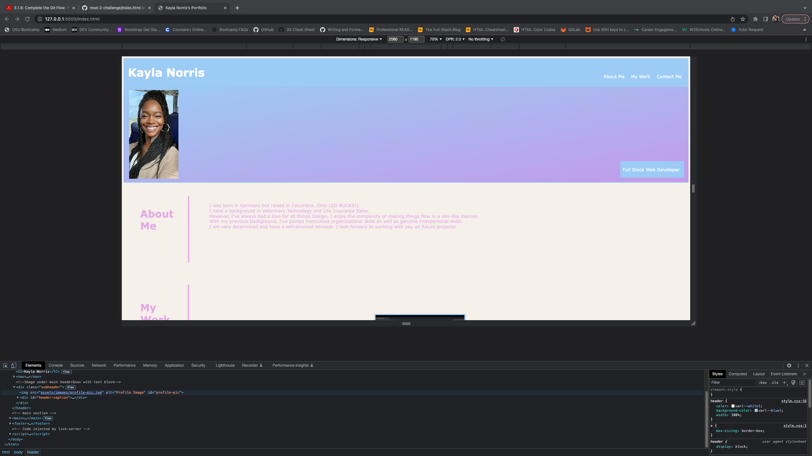
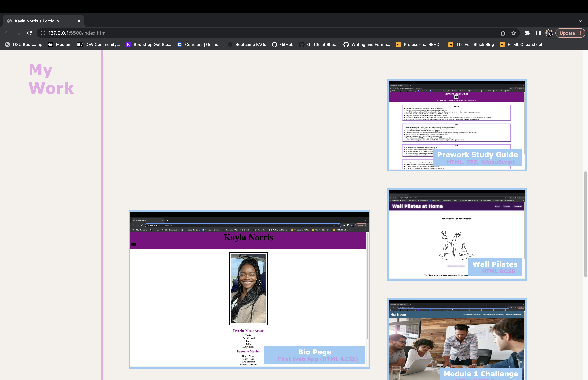
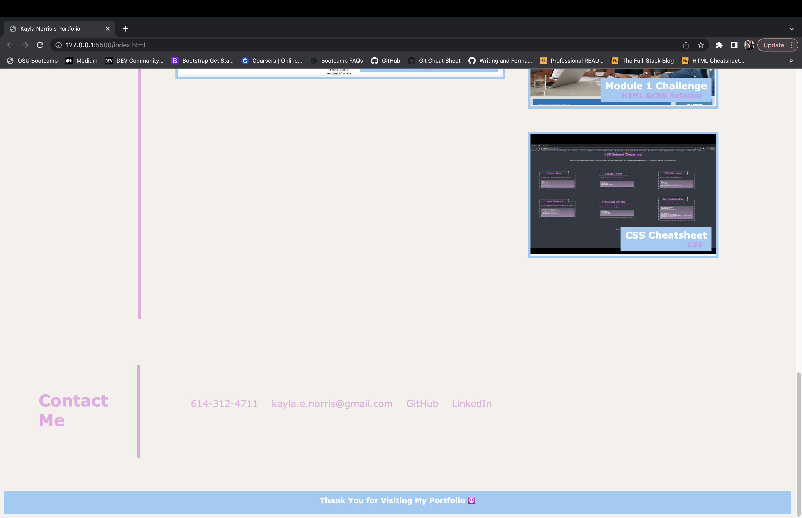

# Portfolio

## Description

This application was made so I can have a deployed portfolio of my work. I wanted to add a profile picture so potential employers and/or partners can put a face to my name. I also wanted to add an about me section so they can have an idea on my background and interests. At the bottom of the page all of my contacts are listed so people can get in touch with me however they choose. The navigtion bar at the top was made so people can access particular parts of my portfolio more conveniently. I wanted to provide the links to the actual deployed applications as well. I linked the deployed applications through each corresponding screenshot and included instruction to click on said screenshots to access the application. I highlighted my first application by making its screenshot larger in size. I also added some media queries and flexboxes to make my website responsive.

## Installation

N/A

## Usage

The page has links in the header that will jump to the specified section on the webpage. The deployed applications can be accessed by clicking on the screenshots. 

 https://kaylanorris.github.io/portfolio/

## License

Please refer to the license in the REPO.

